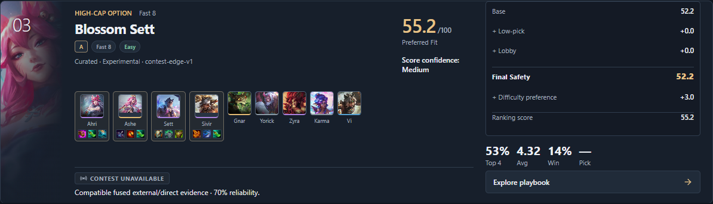
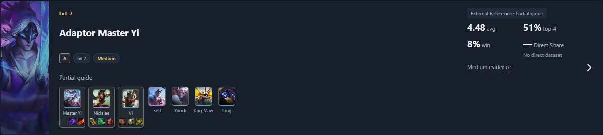
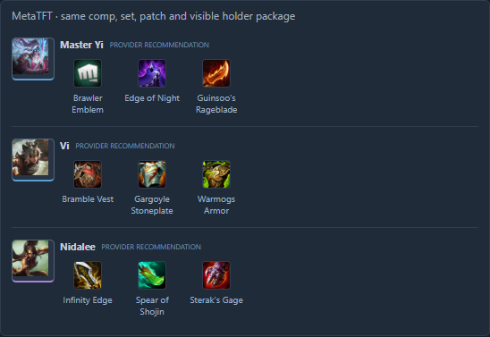
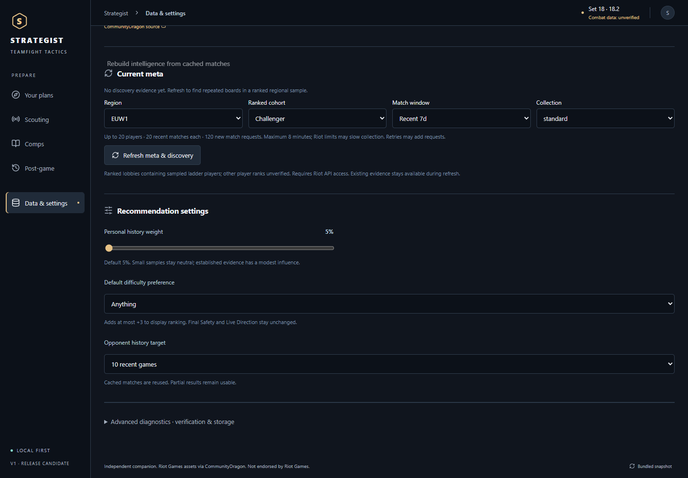

# MetaTFT Comp Enrichment Report

Date: 2026-09-13

Branch: `codex/m12-final-companion`
Active scope: Set 18 / Patch 18.2 / ranked queue 1100 / Plat+ / last 3 days

## Outcome

The MetaTFT public-page collector now enriches matched comp cards with explicit provider tier, explicit difficulty, same-card leveling style, and verified item-holder packages. Home adds an optional Easy/Medium/Hard/Anything preference that can reorder close alternatives with a single `+3` exact-match nudge while leaving the existing strategic scores unchanged.

The result is intentionally descriptive. Provider metadata does not become a game rule, direct-Riot evidence, or an inferred strategy instruction.

## Source fields and verification

The collector uses MetaTFT's ordinary public comp page and the structured public responses already emitted by that page. Live DOM verification on 2026-09-13 confirmed:

- stable comp-row identity through `row_<providerCompId>`;
- explicit tier badges in the same comp row;
- explicit `Easy`, `Medium`, or `Hard` labels in the same comp row;
- same-row leveling labels such as `Fast 8` and `Fast 9`;
- unit links and item links nested under the visible unit holder.

Representative live checks included `Blossom Sett` (A / Fast 8 / Easy), `Lunar Aphelios Nidalee` (S / Fast 8 / Medium), and `Inferno Draven` (S / Fast 9 / Hard). Visible item-holder associations agreed with the corresponding structured same-cluster build packages for those cards.

The normalizer deliberately ignores the undocumented numeric `difficulty` value in definition responses. Only the explicit rendered label is mapped. An ambiguous or missing label becomes `unknown`.

Item packages require all of the following:

1. A visible holder and visible item links in the same rendered provider comp row.
2. A holder present in that row's lineup.
3. Canonical unit/item identifier mapping.
4. Exact holder and ordered-item agreement with a structured build from the same provider cluster.
5. At display time, a strong internal-to-provider comp match plus exact set, patch, and hotfix provenance.

Unmapped or contradictory packages are skipped. If more than 10% of attempted packages fail verification, normalization fails instead of silently activating questionable data.

## Refreshed snapshot

`npm.cmd run metatft:refresh` completed successfully and atomically activated the refreshed snapshot.

| Measure | Result |
| --- | ---: |
| Mapped comps | 54 |
| Explicit provider tier | 48 |
| Explicit leveling style | 54 |
| Easy | 25 |
| Medium | 15 |
| Hard | 8 |
| Unknown difficulty | 6 |
| Comps with verified packages | 48 |
| Verified holder packages | 178 |
| Provider population | 6,198,330 boards |

Snapshot provenance: collector `public-page-v2`, normalizer `comps-v2`, content hash `fnv1a-357f7af8`, retrieved `2026-09-13T16:48:25.338Z`. Hotfix parity remains explicitly unverified because the provider did not expose a separate hotfix identifier.

## Recommendation behavior

The difficulty preference is applied after the existing scoring pipeline:

`Ranking score = Live Direction + exact difficulty match (0 or +3)`

- `Anything`: `+0` for every comp.
- Exact Easy/Medium/Hard match: `+3`.
- Non-match or unknown difficulty: `+0`.
- No negative adjustment exists.
- `Final Safety` remains `Base + Low-pick + Lobby`.
- `Live Direction` remains `Final Safety + live owned/shop adjustments`.
- A locked plan/session is never replaced.

The Home control is session-only until **Use as default** is selected. The default is stored in existing settings storage; no database migration was required.

## UI verification

`npm.cmd run tauri dev` launched the real desktop application. The same rendered frontend was inspected at 1440×1000 and exercised with a focused Playwright acceptance test.

- Home: provider tier, difficulty, leveling style, holder emphasis, and item icons render compactly on all three primary cards.
- Home preference: selecting Easy moved `Blossom Sett` into the primary portfolio. Its displayed ranking became `55.2 Preferred Fit`, with an explicit `+3.0` row, while `Final Safety` remained `52.2`.
- Comps: enriched library cards show compact provider badges and place item icons directly below the correct holder.
- Playbook: the details view labels packages `MetaTFT · same comp, set, patch and visible holder package` and each holder as a `provider recommendation`. Strategy coverage remains distinct.
- Settings: the persisted default offers Anything, Easy, Medium, and Hard and explains the +3 cap and score invariants.

Screenshots:

## Verification commands

- `npm.cmd run metatft:refresh` — passed; 54 comps activated for Patch 18.2.
- `npm.cmd test -- --reporter=dot` — passed; 50 files, 667 tests.
- `npm.cmd exec playwright -- test e2e/metatftEnrichment.spec.ts` — passed; 1 focused rendered acceptance test.
- `npm.cmd run typecheck` — passed.
- `npm.cmd run lint` — passed.
- `npm.cmd run build` — passed; existing non-fatal Rollup/Zod and bundle-size warnings remain.
- repo-local Cargo `test --manifest-path src-tauri/Cargo.toml` — passed; 84 Rust tests.
- `npm.cmd run format:check` — repository-wide check remains red on 65 files, including many unrelated pre-existing files. Every file changed by this task was formatted directly with Prettier.

## Files changed

- Provider schema, collection, normalization, snapshot generation, and provenance: `src/domain/externalMeta.ts`, `scripts/metatft-refresh.ts`, `scripts/metatft-normalize.ts`, `public/data/external/current.json`, `public/data/external/history.json`.
- Persistence round-trip: `src/storage/knowledgeImporter.ts`, `src/storage/knowledgeRepository.ts`, `src/services/knowledgeBootstrap.ts`, `src/services/knowledgeCatalog.ts`.
- Conservative scoring and settings: `src/strategy/homeScoring.ts`, `src/services/application.ts`, `src/storage/repository.ts`, `src/domain/models.ts`, `src/app/App.tsx`.
- UI: `src/components/CompEnrichment.tsx`, `src/features/Home.tsx`, `src/features/CompLibrary.tsx`, `src/features/Playbook.tsx`, `src/features/DataSettings.tsx`, `src/styles/product.css`.
- Coverage: `src/test/metatftCompEnrichment.test.ts`, `e2e/metatftEnrichment.spec.ts`, plus updated settings fixtures.

## Remaining gaps and risk

- Six mapped provider cards have no explicit public difficulty label and correctly remain `unknown`.
- Provider hotfix parity is not exposed and remains unverified; package display requires exact stored hotfix scope, including the current empty identifier.
- MetaTFT can change its public DOM or response shape. The collector fails closed on identity, scope, mapping, completeness, package-verification ratio, and final schema/hash checks; the last good snapshot remains usable.
- External final-board observations still do not establish augments, pivot rules, stage instructions, or causal item superiority. Those fields remain unavailable unless supported by separate evidence.
